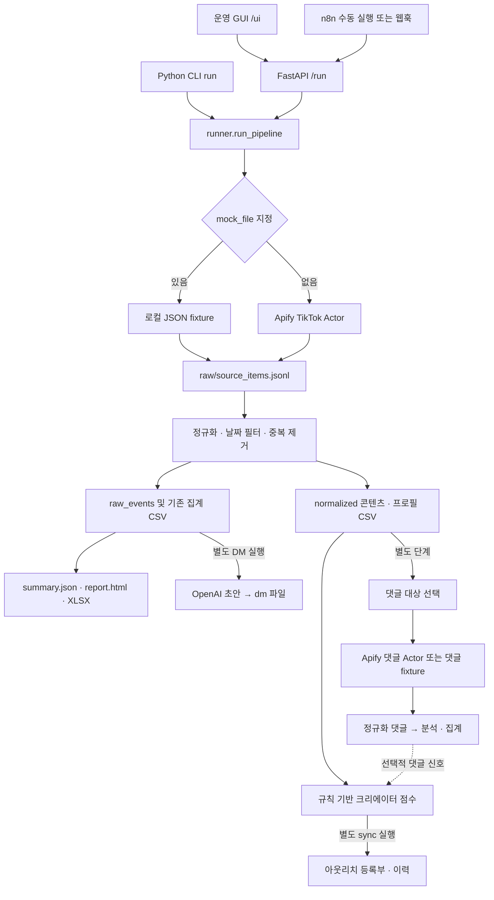

# 현재 아키텍처

이 문서는 [현재 Python 소스](../apps/pipeline/src/southpole_pipeline/), [루트 Compose](../docker-compose.yml), [현재 n8n 워크플로](../n8n/workflows/southpole_run_pipeline.json)를 기준으로 설명합니다. 구현 여부와 외부 서비스의 실제 실행 검증은 별개입니다. 확장 계획은 [로드맵](roadmap.md)에 분리합니다.

## 실행 구성

`pipeline`은 FastAPI와 파일 기반 Python 처리 코드입니다. `/ui`의 HTML/JavaScript도 같은 서비스가 제공합니다. React 별도 앱이나 프런트엔드 빌드 과정은 없습니다. 기본 포트는 pipeline 8080, n8n 5678입니다. GUI/API/CLI로 pipeline을 직접 사용하면 n8n은 필요하지 않습니다.

화살표의 별도 단계는 자동 후속 실행을 뜻하지 않습니다. `POST /run`은 보고서·워크북까지 생성하고 종료합니다. 댓글·점수·아웃리치·DM은 각 API 또는 CLI 명령을 따로 호출합니다. [서비스 실행/API 안내](../apps/pipeline/README.md)에 실제 명령과 요청 경계가 있습니다.

## 모듈과 데이터 흐름

| 모듈 | 책임 |
| --- | --- |
| [config.py](../apps/pipeline/src/southpole_pipeline/config.py) | 프로세스 환경에서 API 키, Actor, 모델, 시간대, 출력 경로 읽기 |
| [api.py](../apps/pipeline/src/southpole_pipeline/api.py), [cli.py](../apps/pipeline/src/southpole_pipeline/cli.py) | 요청/인자 해석과 단계 호출. API POST는 처리 완료까지 대기 |
| [operator_ui.py](../apps/pipeline/src/southpole_pipeline/operator_ui.py) | 수집·DM 생성 폼, 실행 목록, `creators.csv` 미리보기, 산출물 링크 |
| [collector.py](../apps/pipeline/src/southpole_pipeline/collector.py) | Apify 동기 Actor 요청 또는 JSON fixture 읽기. TikTok 게시물과 댓글만 연결 |
| [normalize.py](../apps/pipeline/src/southpole_pipeline/normalize.py), [models.py](../apps/pipeline/src/southpole_pipeline/models.py) | Actor 응답 필드 변환, 날짜 처리, canonical ID와 원문 참조 |
| [aggregate.py](../apps/pipeline/src/southpole_pipeline/aggregate.py) | 키워드·크리에이터·일자 집계, canonical 프로필, 조회수 기반 댓글 대상 선택 |
| [runner.py](../apps/pipeline/src/southpole_pipeline/runner.py), [writers.py](../apps/pipeline/src/southpole_pipeline/writers.py) | 단계 조합, CSV/JSONL/JSON/HTML/XLSX 기록, 단계별 요약 갱신 |
| [comment_analysis.py](../apps/pipeline/src/southpole_pipeline/comment_analysis.py) | OpenAI 댓글 분석 시도와 휴리스틱 대체, 콘텐츠별 지표·토픽 |
| [scoring.py](../apps/pipeline/src/southpole_pipeline/scoring.py) | 프로필·댓글 신호의 고정 가중치 점수와 권장 행동 |
| [dm_generator.py](../apps/pipeline/src/southpole_pipeline/dm_generator.py) | 기존 크리에이터 집계에서 OpenAI DM 초안·복사용 검토 HTML 생성 |
| [outreach_state.py](../apps/pipeline/src/southpole_pipeline/outreach_state.py) | 캠페인별 후보 CSV, 실행 간 등록부 upsert와 JSONL 이력 추가 |

게시물 수집은 키워드를 Apify의 hashtag/search 입력으로 보냅니다. `days`는 수집 이후 정규화 단계에서 게시 날짜를 거르는 값입니다. 게시 날짜를 읽을 수 없으면 수집 시각을 사용합니다. 본문/해시태그에 키워드가 일치하지 않은 응답도 입력 키워드에 대체 배정하므로 결과 전체가 엄격한 검색 일치 집합이라는 뜻은 아닙니다.

기존 `raw_events`는 `(keyword, post_id)`, canonical 콘텐츠는 `(keyword, canonical_content_id)` 기준으로 실행 안의 중복을 제거합니다. canonical ID에 `platform`이 포함되어 있지만 다중 SNS 수집기가 연결된 것은 아닙니다. `raw_ref`는 원본 JSONL 행을 가리킵니다. 게시물의 행별 `source`는 현재 고정 Apify 문자열이므로 fixture 여부는 `summary.json`의 `source.provider`로 확인해야 합니다.

## 파일과 상태 경계

기본 호스트 저장 위치는 다음과 같습니다. 세부 필드는 [출력 파일 스키마](output-files.md)를 참고하세요.

| 위치 | 생성 시점과 역할 |
| --- | --- |
| `outputs/runs/<run_id>/raw/source_items.jsonl` | 게시물 원본 응답 또는 fixture |
| 같은 실행의 `raw_events.*`, `keyword_totals.csv`, `creators.csv`, `daily_metrics.csv` | 기존 호환 출력. DM은 이 `creators.csv`를 계속 사용 |
| 같은 실행의 `normalized/*.csv` | 콘텐츠·크리에이터 canonical 표. 댓글/점수 입력 |
| 같은 실행의 `summary.json`, `report.html`, `southpole_run_*.xlsx` | 기본 실행 요약·보고서·워크북 |
| 같은 실행의 `comments/` | 명시적으로 실행한 대상·댓글 원문·정규화·인사이트·지표·토픽·보고서. 수집 메타데이터는 `comment_collection_meta.json` |
| 같은 실행의 `scoring/`, `outreach/` | 점수와 해당 실행의 아웃리치 후보 |
| 같은 실행의 `dm/` | OpenAI 초안 CSV/JSON, `dm_review.html`, 크리에이터별 텍스트 파일 |
| `outputs/operator_state/` | `outreach_registry.csv`와 `outreach_history.jsonl`. 실행 폴더와 별개로 유지 |
| `state/n8n/` | 현재 n8n SQLite 데이터·설정·워크플로 실행 상태. pipeline의 분석 DB가 아님 |

실행 폴더는 시각+slug로 만들고 이름 충돌을 피합니다. 후속 단계는 선택한 폴더의 파일을 덮어쓰거나 요약을 갱신합니다. DM 재생성도 같은 위치를 사용하며 이전 메시지 파일 정리·버전 관리는 별도 구현되어 있지 않습니다. DB 트랜잭션, 작업 큐, 동시 쓰기 잠금이나 중단 작업 재개 모델은 없습니다. 같은 실행/상태 파일을 변경하는 작업은 순차 실행하는 운영 방식입니다.

아웃리치 등록부의 키는 `(platform, canonical_creator_id, campaign_id)`입니다. 재동기화는 전달된 `status`로 기존 상태도 갱신할 수 있습니다. 기본값 `pending_review`가 승인 상태를 보존한다는 보장은 없습니다. 연락/회신 일자와 결과 필드는 존재하지만 메시지 전송·회신 수집과 연결되어 있지 않고, 새 후보의 `draft_path`도 비어 있습니다.

## 선택 기능의 실제 범위

| 기능 | 현재 구현과 한계 |
| --- | --- |
| 댓글 대상 | 조회수 내림차순 상위 콘텐츠. `selection_mode`는 현재 선택 사유의 라벨이며 별도 선택 알고리즘을 바꾸지 않음 |
| 댓글 수집 | 별도 `APIFY_TIKTOK_COMMENTS_ACTOR_ID` 필요. 여러 Actor 입력 형태를 순차 시도하지만 모든 Actor 호환을 보장하지 않음 |
| 댓글 분석 | 댓글별 OpenAI 호출을 시도하고 키 누락/오류면 휴리스틱 적용. 출력 `analysis_model`은 대체 사용 여부를 구분하지 않음 |
| 점수 | 콘텐츠 적합도·참여·일관성·댓글·구매 신호·위험의 규칙 계산. 댓글이 없어도 기본값으로 계산하므로 실제 구매 가능성/성과 검증값이 아님 |
| DM | `creators.csv`에서 기본 10명, 한국어/영어/자동 언어 선택. OpenAI 키 필수. 점수/등록부와 자동 연결되지 않음 |
| 검토 화면 | 생성 텍스트 확인, 복사, 프로필/텍스트 파일 열기. 승인·반려 저장이나 TikTok 발송 버튼 없음 |

GUI에는 수집과 DM 생성만 연결되어 있습니다. 댓글·점수·아웃리치 API가 있다는 사실을 해당 화면까지 구현됐다는 의미로 사용하지 않습니다.

## n8n과 이전 구성

현재 [southpole_run_pipeline.json](../n8n/workflows/southpole_run_pipeline.json)은 Manual Trigger 또는 `southpole/run-pipeline` POST 웹훅에서 `http://pipeline:8080/run`을 호출합니다. 전달 필드는 `keywords`, `days`, `slug`, `source`이며 `mock_file`은 전달하지 않습니다. 주기 트리거, 댓글 후속 단계, OpenAI/DM 단계는 포함하지 않습니다. export는 비활성 상태이며 [import-workflows.sh](../scripts/import-workflows.sh)가 가져오기·활성화를 처리합니다.

루트 [workflows/](../workflows/)의 KoreaSignals JSON들은 Google Sheets 노드를 포함한 이전 실행 구성입니다. [docker/docker-compose.instance2.yml](../docker/docker-compose.instance2.yml)은 별도 n8n/PostgreSQL 인스턴스입니다. 이 파일들의 export 상태나 노드를 현재 루트 Compose에서 작동하는 연동으로 해석하지 않습니다. 현재 수집/분석 결과 저장은 로컬 파일이며 Google Sheets, Looker Studio 또는 PostgreSQL은 기본 경로의 필수 구성요소가 아닙니다.

## 접근 및 확장 경계

pipeline API에는 로그인·사용자별 권한이 없고 요청이 서버 파일 경로를 지정할 수 있습니다. `/artifacts`는 `OUTPUT_ROOT`의 부모 폴더를 노출하므로 기본값에서는 실행 결과뿐 아니라 형제 `operator_state`도 접근할 수 있습니다. 루트 Compose 포트는 loopback에 한정되지 않아 현재 구성을 그대로 공개 서비스로 배포할 수 있는 인증 경계로 보지 않습니다. `.env`, 로컬 실행 데이터, n8n 상태와 로그는 저장소 밖의 운영 데이터로 취급합니다.

TikTok 외 SNS 수집, 통합 OAuth, 멀티테넌트 권한, 콘텐츠 제작·게시·예약, 자동 DM 발송, Clay 연동은 현재 구현에 없습니다. 특히 자동 TikTok DM 발송은 저장소 운영 규칙에서 제외합니다. [로드맵](roadmap.md)은 확장 논의를 위한 문서이며 현재 API·GUI의 완료 목록이 아닙니다.
