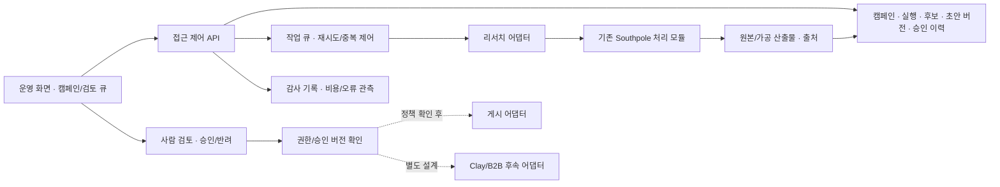

# 서비스 확장 로드맵

이 문서는 현재 TikTok 로컬 리서치 도구와 향후 서비스 구상을 분리한다. 아래 단계는 **개발 계획**이며 완료 기능 목록이 아니다. 현재 구조는 [아키텍처](architecture.md), 재현 범위는 [검증 기록](verification.md)을 따른다.

## 기준과 참고 자료

- 구현 기준: 공개 저장소의 Python 파이프라인·GUI·현재 n8n 래퍼. 별도 SocialHub/Flux 결과를 이 저장소의 기능으로 합산하지 않는다.
- 확장 방향: 캠페인별 리서치·운영 검토, 플랫폼별 연결, 게시 승인, B2B 후속 업무의 단계적 설계.
- `SPEC.md`와 참고 이미지 3장의 원문은 아직 확인되지 않았다. 해당 자료의 화면·요구사항·권리와의 대응은 **검토 대기**다. 아래 내용은 코드와 확인된 확장 방향을 기반으로 한 초안이며 명세 대조 완료를 뜻하지 않는다.
- Southpole_AI의 정부지원 사업 기초자료·지침은 별도 사업 맥락이며 이 프로젝트의 구현 실적·사용자 성과·지원사업 수혜 근거로 사용하지 않는다.

## 현재 구현과 계획의 경계

| 영역 | 현재 | 향후 검토 |
| --- | --- | --- |
| 탐색 | TikTok/Apify와 모의 fixture 입력, 키워드·기간 GUI | 비동기 작업과 취소·재시도·실패 상태 |
| 데이터 | 로컬 파일, 실행별 집계·보고서 | 캠페인/실행/크리에이터의 지속 모델과 변경 이력 |
| 후보 검토 | 크리에이터 미리보기, 별도 점수/상태 API | 검토 큐·담당자·승인 이력·근거 연결 |
| DM | 별도 OpenAI 초안 생성과 복사 가능한 검토 파일 | 승인된 초안 버전·재검토·발송 정책 설계. 자동 발송은 현재 범위 아님 |
| 게시 | 구현 없음 | 콘텐츠 초안·사람 승인·플랫폼 어댑터·결과 기록 |
| 다중 SNS/OAuth | 구현 없음. 공통 스키마의 platform 필드만 있음 | 플랫폼별 접근 권한·지원 범위 검증 후 개별 연결 |
| B2B/Clay | 구현 없음 | 리드 출처·키 매핑·중복 관리·승인된 후속 작업 |
| 운영 | 인증 없는 로컬 API | 접근 제어·비밀정보 저장·감사 로그·배포/복구 |

## 단계별 계획과 완료 기준

| 단계 | 작업 범위 | 확인 가능한 완료 기준 | 선행 조건·주요 위험 | 상태 |
| --- | --- | --- | --- | --- |
| 0. 현재 동작 기준 고정 | 모의/실제 호출 구분, 기간·빈 결과·파일 계약, 로컬 실행 문서 | 동일 fixture의 행 수·집계 값·GUI 결과 일치; 실서비스 호출은 별도 기록 | 오래된 fixture의 0행 통과, 누락 지표, API 키/비용 | 모의 근거 확보, 실서비스 검증 별도 |
| 1. 리서치 처리 안정화 | 작업 상태·재시도·수집량 제한, 분석 방식 표시, 단계별 실행 계약 | 요청 실패·부분 결과·재실행에서 중복/상태 처리 재현; 실제 상한 적용 확인 | 현재 동기 요청, 미적용 설정, 휴리스틱을 AI로 오인할 가능성 | 기획 |
| 2. 캠페인 운영 모델 | 캠페인→run→후보/콘텐츠/초안 연결, 원문 출처·담당자·검토 상태 | 과거 실행과 최신 검토 상태를 함께 조회; 재수집해도 승인 결정을 임의 초기화하지 않음 | 현재 CSV 상태 동기화가 기존 상태를 덮어쓸 수 있음; 마이그레이션 필요 | 기획 |
| 3. 게시·DM 승인 설계 | 초안 버전, 승인/반려/보류 이유, 권한, 승인 대상의 불변 식별자 | 수정된 초안은 재승인 필요; 승인·실행·실패 로그 구분; 승인 없는 외부 액션 차단 | 승인 UI/서버 저장 미구현; 플랫폼 정책·오발송·계정 권한 | 기획 |
| 4. 플랫폼별 연결 | 플랫폼별 수집/OAuth/게시 어댑터, 토큰 보관과 갱신 | 플랫폼마다 허용된 계정·데이터·액션으로 독립 테스트; 공통 모델 매핑과 제한 기록 | API 접근/사용 조건·요금·rate limit·데이터 권리 확인 필요 | 기획 |
| 5. Clay B2B 후속 모델 | 회사/담당자 리드, 출처·동의·외부 ID, 중복 방지와 동기화 방향 | 승인한 샘플 리드의 매핑·중복·재시도·삭제 처리를 검증 | Clay 연결·인증·데이터 권한·비용·CRM 운영 정책 미확정 | 기획 |
| 6. 서비스 운영 | 사용자/조직 분리, 역할, 비밀정보 저장소, 큐/DB, 모니터링·복구 | 권한 경계·감사 로그·백업 복원·실패 복구·비용 제한 테스트 | 현재 로컬 도구를 그대로 외부 배포할 수 없음 | 기획 |

단계 번호는 기능의 완성이나 확정 일정이 아니다. 외부 서비스 검증과 권리 확인 결과에 따라 범위를 조정한다. 자동 DM 발송을 기본 동작으로 도입하는 계획은 포함하지 않는다.

## 향후 아키텍처 초안 — 미구현

기존 수집·정규화·집계 모듈을 재사용할 수 있지만, 큐·인증·DB·승인·외부 어댑터는 현재 구현되어 있지 않다. 파일/API 기반 읽기 전용 연결을 먼저 검증하고, 지속 상태와 외부 쓰기 액션을 분리한다. 메시지는 검토 가능한 초안을 유지하며 자동 DM 발송을 구현 사실로 취급하지 않는다.

## 데이터 경계와 보류 결정

- 기존 `run_id`, canonical 콘텐츠/크리에이터 ID, `raw_ref`는 출처 추적의 입력 후보다. 현재 파일 경로를 영구 외부 URL로 가정하지 않는다.
- Campaign/Run/Creator/Content/DraftVersion/ReviewDecision/ActionLog는 제안 모델이다. 현재 CSV의 `campaign_id`만으로 이 모델이 구현된 것은 아니다.
- Clay 리드와 SNS 크리에이터의 동일인 여부는 추정하지 않는다. 연결 근거·출처·갱신 책임과 삭제 규칙을 별도로 정한다.
- 승인 의미, 역할 권한, 게시 플랫폼 우선순위, 데이터 보존 기간과 상세 화면은 명세·도식 원문 검토 후 확정한다.
- 공개 가능한 코드·참고 자산·샘플 범위는 [공개 이력 점검](public-history-review.md)의 미확정 사항과 함께 확인한다.
