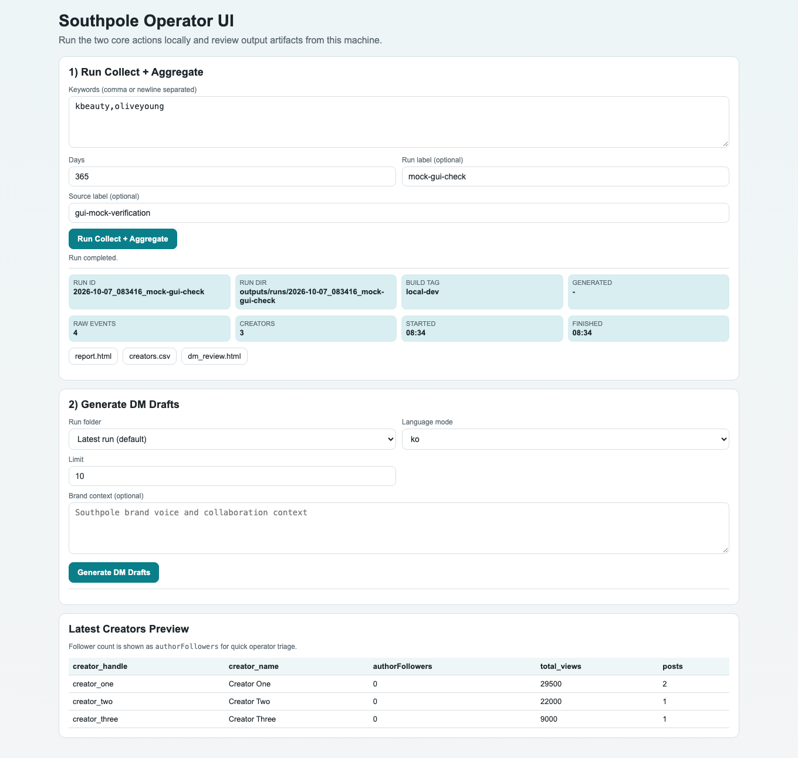

# 모의 실행 및 GUI 검증

코드 기준: `7888769`. 검증일: 2026-10-07 KST. Python 3.12.14, Chromium 153.0.8010.12. [기계 판독 기록](evidence/verification.json)에 실행 시각·소스 해시·검사 범위를 기록했다. 앱의 Python 코드·의존성·fixture는 변경하지 않았다.

## 입력과 결과

기존 [고정 fixture](../apps/pipeline/fixtures/mock_apify_items.json)의 게시물 4건을 사용했다. 실제 TikTok 계정이나 수집 성공을 검증한 데이터가 아니다.

| 경로 | 입력 | 관측 결과 |
| --- | --- | --- |
| CLI, 7일 | `kbeauty,oliveyoung`, `--mock-file`, `days=7` | 게시물·크리에이터 0행. 파일은 생성됨 |
| CLI, 365일 | 같은 fixture, `days=365` | 게시물 4행, 키워드 2행, 크리에이터 3행, 일별 집계 3행 |
| GUI→Python API | 같은 키워드와 365일, 테스트에서 `mock_file` 추가 | HTTP 200, 화면의 크리에이터 3명, HTML 보고서 HTTP 200 |
| GUI 빈 키워드 | 입력 없이 실행 | 요청 전 입력 안내 표시 |
| API 빈 키워드 | 빈 문자열로 `/run` 요청 | HTTP 400 |
| AI 키 없는 DM 요청 | 위 모의 실행 결과를 선택 | HTTP 400, `OPENAI_API_KEY` 필요 안내. AI 성공 결과로 세지 않음 |

두 CLI 실행 모두 HTML·JSON·CSV·canonical 파일 10종과 XLSX가 존재함을 확인했다. 브라우저 검사 중 외부 요청 시도와 JavaScript 페이지 오류는 0건이었다. 수집·AI의 실서비스 호출은 수행하지 않았다.

## 실제 화면

키워드를 입력하고 모의 API 실행을 마친 실제 GUI다. 이미지에 보이는 값은 fixture에서 생성한 것이다.



[실제 API 결과 JSON](evidence/mock-run-summary.json) · [실제 크리에이터 CSV](evidence/mock-creators.csv) · [산출물 SHA-256](evidence/artifact-sha256.json)

예를 들어 `creator_one`의 게시물 2건 조회수 `12,000 + 17,500 = 29,500`을 CSV와 화면에서 확인했다. fixture에 팔로워 값이 없어 화면에 표시된 `0`은 실제 팔로워 수 확인 결과가 아니다. 생성 전에도 GUI에 `dm_review.html` 링크가 표시될 수 있으며, AI 초안을 만들기 전에는 해당 파일이 없다.

## 재현 명령

[Python 환경 준비](../REBUILD.md#python-단독-실행) 후 저장소 루트에서:

```bash
PYTHONPATH=apps/pipeline/src OUTPUT_ROOT=outputs/runs \
  python -m southpole_pipeline.cli run \
  --keywords 'kbeauty,oliveyoung' --days 365 --slug mock-check \
  --mock-file apps/pipeline/fixtures/mock_apify_items.json
```

API가 실행 중이면 동일 처리를 직접 호출할 수 있다.

```bash
curl -sS http://127.0.0.1:8080/run \
  -H 'Content-Type: application/json' \
  -d '{"keywords":"kbeauty,oliveyoung","days":365,"slug":"mock-check","source":"manual-mock","mock_file":"apps/pipeline/fixtures/mock_apify_items.json"}'
```

이는 Python 단독 실행의 상대 fixture 경로다. 컨테이너에서는 `/app/fixtures/mock_apify_items.json`을 사용한다. API/CLI 요청 후 `/ui`를 열거나 새로고침하면 실행 목록과 크리에이터 미리보기를 확인할 수 있다. fixture 날짜와 현재 날짜의 간격이 바뀌면 기간 필터 결과도 바뀐다.

## 브라우저 검사의 구분

GUI에는 모의 데이터 선택 기능이 없다. 캡처 검증에서는 Playwright가 실제 버튼의 `POST /run` 요청에 `mock_file` 필드만 추가했다. 응답을 가짜 JSON으로 대체하지 않았으며, 수정하지 않은 Python API가 fixture를 읽고 파일을 생성했다. 이것은 테스트 보조 방식이고 제품 기능이 아니다. GUI의 원래 요청·추가 필드·응답 건수는 [검증 JSON](evidence/verification.json)의 `browserVerification`에 있다.

격리한 로컬 API는 키 없이 loopback 포트 18080에서 실행했다. 공개 문서의 기본 포트 8080과 구분하며, 제품 기본 설정은 바꾸지 않았다. 소스 해시와 캡처 해시가 기록된 코드·산출물의 대응을 확인한다.

## 실행하지 못했거나 검증하지 않은 범위

- `bash scripts/verify.sh`는 실제로 시도했으나 Docker 데몬에 연결할 수 없어 종료 코드 1이었다. Docker Compose 실행 성공을 주장하지 않는다.
- 위 Python 모의 검증은 같은 처리 코드를 확인한 대체 경로이며 Docker·n8n·시작 런처의 성공을 대신하지 않는다.
- `verify.sh` 자체는 7일 창과 파일 존재만 검사한다. 고정 fixture가 기간 밖이면 0행이어도 통과할 수 있다.
- 실제 Apify 수집, 성공한 OpenAI 초안, 댓글/점수/아웃리치 단계의 실행, 레거시 Sheets/Looker 연동, 모든 UI 조작을 검증하지 않았다.
- 자동 DM 발송·게시·다중 SNS·Clay는 현재 구현 기능이 아니므로 실행 성과로 포함하지 않는다.

## 문서·식별자 정리 검증

- 문서 상대 링크와 diff 공백 검사, `scripts/check-portability.sh`를 확인했다. 끊어진 파일 링크와 의심스러운 개인 절대경로는 없었다. CSV 원본의 CRLF는 보존하고 `git -c core.whitespace=blank-at-eol,blank-at-eof,space-before-tab,cr-at-eol diff --check`로 검사했다.
- instance2 helper 3개는 `bash -n`을 통과했다. Docker 명령을 로컬 테스트 stub으로 대체하고 다른 작업 디렉터리에서 실행해 저장소의 `docker/`로 이동하는지 확인했다. 실제 Docker/legacy 서비스 실행 검증은 아니다.
- legacy workflow export 3개를 JSON 구조로 비교해 `shared[].project.name`의 표시명 8곳 외 node/연결/설정이 같음을 확인했다.
- 기능 소스·fixture·요구 패키지·현재 Compose/n8n 래퍼는 변경하지 않았다. 개인정보 값은 점검 보고서에 재기재하지 않았다.
